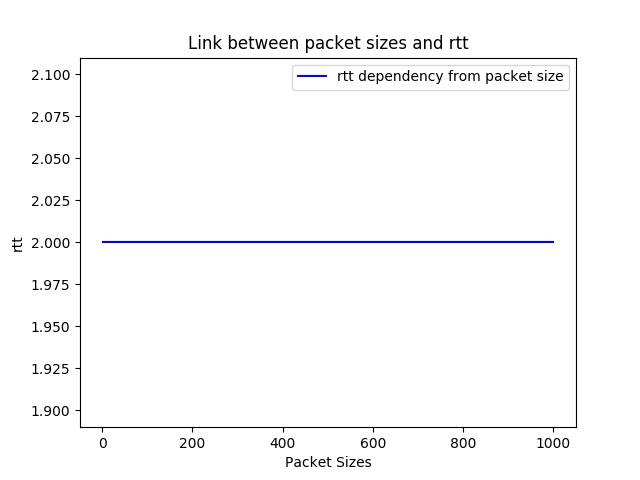

# Assignment 3 Report

## Task 1:
Per creare le due FSM per client e server, abbiamo analizzato l'assignment producendo due flow charts. Il primo, quello del client, é il seguente:

Notiamo come, nel caso si abbiano delle interazioni, il messaggio del client é sempre quello sopra la _linea_ mentre quello del server é al di sotto.

Il secondo schema é invece il seguente:

Anche in questo caso il messaggio del client é sempre quello sopra la _linea_ mentre quello del server é al di sotto.

## Task 2:
La soluzione adottata prevede la realizzazione di due componenti principali: client e server.

Il primo prevede di ricevere in input, come argomenti, indirizzo IP e porta del server. 
Come prima cosa esso prova ad aprire una connessione TCP con il server e dopodichè, se la connessione ha successo, procede a richiedere da `stdin` i vari parametri della misurazione (operazione, dimensioni, numero di misurazioni per ogni dimensione, ritardo del server).
Una volta richiesti i parametri si avvia la vera e propria fase di misurazione, dove il comportamento è quello descritto nel diagramma a stati finiti presente nel Task 1.

Il server, invece, prende in input solamente la porta su cui dovrà fare il `bind` in quanto come indirizzo utilizza `INADDR_ANY`. Il comportamento del server è descritto nel diagramma a stati finiti presente nel Task 1.

Per semplificare la lettura, la comprensione e la manutenzione del codice si è deciso di dividere la logica in più file e di accorpare alcune funzioni utili sia a client che a server in un file `utilities` presente nella cartella `src/common/`.
I file relativi al client sono collocati nella cartella `src/client/`, mentre quelli relativi al server sono posti nella cartella `src/server`.

Per compilare i sorgenti e generare i file eseguibili è presente un `Makefile`. È sufficiente eseguire il comando `make` nella home directory del progetto (fuori da `src`) e verranno creati i file `server.exe` e `client.exe`.

Infine sono presenti numerosi commenti che aiutano a comprendere lo scopo delle varie funzioni. Essi sono all'interno degli header `.h` dove presenti, altrimenti nei file `.c`.

### Calcolo dei Risultati
Per calcolare `RTT` e `Throughput` sono state utilizzate le linee guida presenti nella consegna, perciò:
- l'`average RTT` viene calcolato come media di tutti gli `RTT` registrati 
- l'`average Throughput` viene calcolato come media di tutti i `Throughput` registrati, uno per ogni dimensione del messaggio. Ogni `Throughput` viene calcolato come `dimensione del messaggio / average RTT misurato per la dimensione`.
- per calcolare RTT e Throughput sono state utilizzate le misure consigliate, ovvero 1, 100, 200, 400, 800 e 1000 bytes per l'RTT e 1K, 2K, 4K, 16K e 32K per il Throughput

### Grafici Ottenuti
Attraverso l'uso di python e, in particolare, della libreria `matplotlib` abbiamo generato i seguenti grafici con `server delay` impostato a 0:

I grafici sono stati ottenuti utilizzando server e client in una rete locale. Osserviamo come l'RTT si mantiene costante sui 2 millisecondi per le date grandezze dei pacchetti. Ció é in contrasto con quanto ci aspettavamo, in quanto intuitivamente l'RTT dovrebbe crescere a mano a mano che la packet size aumenta. Tale risultato non si verifica peró in quanto le size che passiamo al programma non sono sufficienti a generare piú pacchetti. Osservando invece il throughput, notiamo che l'andamento del grafico non é lineare come si aspettavamo. Tale risultato é probabilmente dovuto a errori di misurazione che sono molto evidenti quanto l'RTT é cosí basso.

Osserviamo ora cosa succede quando il `server delay` é impostato a 1:

Come possiamo osservare, mentre l'RTT si mantiene invariato e costante sugli 1.002 secondi, il throughput appare ora molto piú lineare, esattamente come ci aspettavamo. Infatti, inserire un delay di 1 secondo permette di rendere gli errori assoluti di misurazione del tempo trascurabili. 
